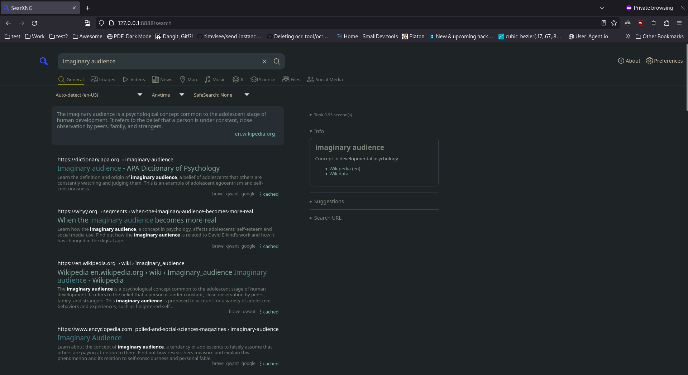

# Everforest Theme for SearXNG

A everforest inspired theme for [SearXNG](https://github.com/searxng/searxng).

## Installation

Unfortunately, installing themes in SearXNG is painfully hard.

The way I did it was to simply overwrite the default `simple` theme.
For this you just need to copy the files from this repo's `searxng`
into your searxng directory.

